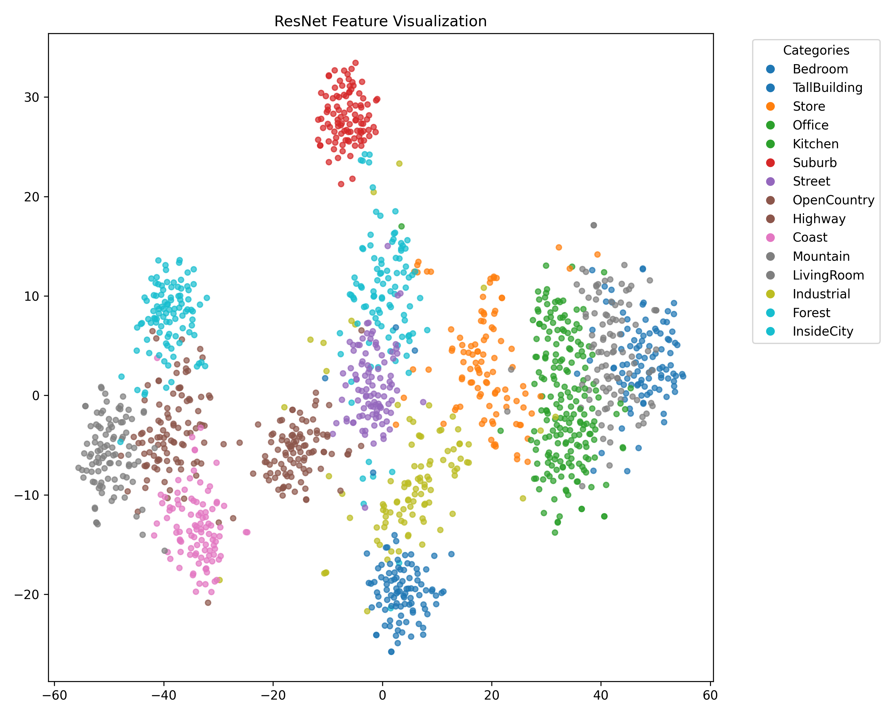

# Scene Recognition: BoVW vs. Deep Learning

This project implements a complete pipeline for scene classification across 15 categories (living room, Office, Forest, etc.). It explores two distinct approaches to feature extraction and compares their performance using classical machine learning classifiers.

## Key Features

* **Feature Extraction:** * **BoVW:** Manual Bag of Visual Words using SIFT descriptors and K-Means clustering.
    * **ResNet:** Transfer Learning using a pre-trained ResNet-18 backbone.
* **Classifiers:** Support Vector Machine (One-vs-All) and K-Nearest Neighbors.
* **Visualizations:** t-SNE embeddings for high-dimensional feature clusters and SIFT keypoint mapping.

## Mathematical Framework

### Bag of Visual Words (BoVW)
The image is represented as a normalized histogram of visual word frequencies:

$$\huge H = \frac{1}{N} \sum_{i=1}^{N} \text{quantize}(d_i, \text{Vocabulary})$$

### SVM Confidence (One-vs-All)
The final category is predicted by the most confident hyperplane:

$$\huge \hat{C} = \arg\max_{c \in \text{Classes}} (W_c \cdot X + b_c)$$

## 📂 Project Structure

| File | Responsibility |
| :--- | :--- |
| `main.py` | Orchestrates training/testing and CLI arguments. |
| `bovw.py` | SIFT extraction, K-Means vocabulary building, and Histograms. |
| `resnet_backbone.py` | Feature extraction using PyTorch ResNet-18. |
| `knn.py` / `svm.py` | Implementation of classification logic. |
| `testing.py` | Script for evaluating single or batch images. |

## 📊 Performance Visualization

<p align="center">
  <table>
    <tr>
      <td align="center"><b>SIFT Keypoints</b></td>
      <td align="center"><b>BoVW Histogram</b></td>
      <td align="center"><b>t-SNE Visualization</b></td>
    </tr>
    <tr>
      <td></td>
      <td></td>
      <td></td>
    </tr>
  </table>
</p>

## 🛠️ Usage

### Training and Evaluation
To run the pipeline with ResNet features and an SVM classifier:
```bash
python main.py --feature resnet --classifier svm --input ./data/ --output ./results

```

To use the traditional Bag of SIFT approach:

```bash
python main.py --feature bovw --classifier knn --input ./data/

```

### Individual Testing

```bash
python testing.py --path_to_an_image "./data/test/Bedroom/image_01.jpg" --type svm --path_to_model "./results/svm_bovw_model.pth"

```

## Results Summary

The project generates a **Confusion Matrix** and **F1-Score** for every run to analyze which scene categories (e.g., "Industrial" vs "Store") are most frequently confused.


## Motive

This project was developed for educational purposes to understand the "math under the hood." While libraries like OpenCV offer optimized versions of these functions (using C++), the algorithms here are implemented in Python/NumPy to demonstrate a deep understanding of the underlying theory.
